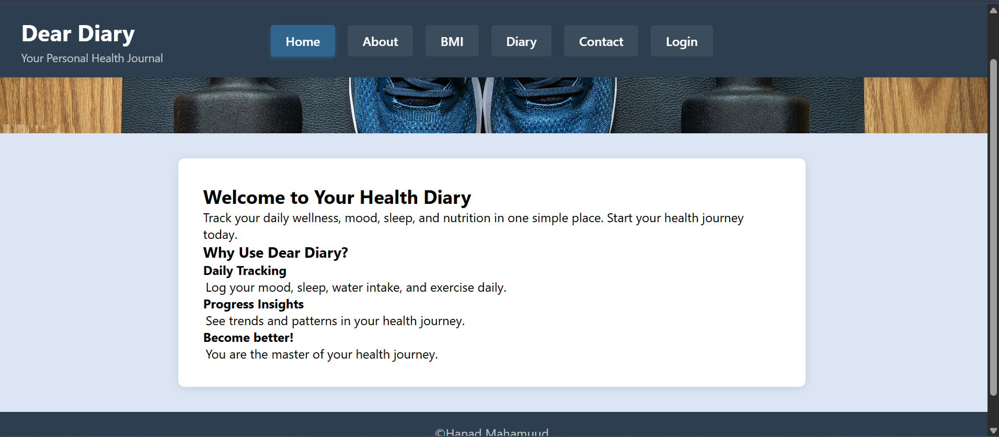
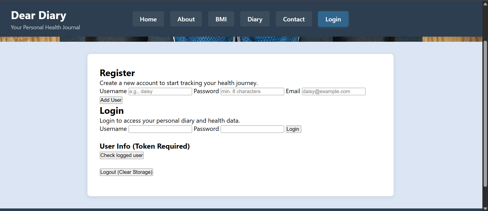
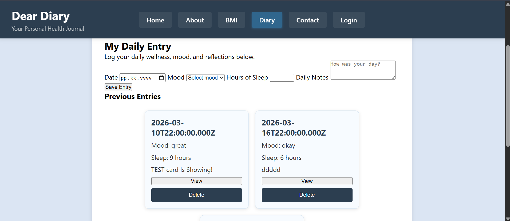
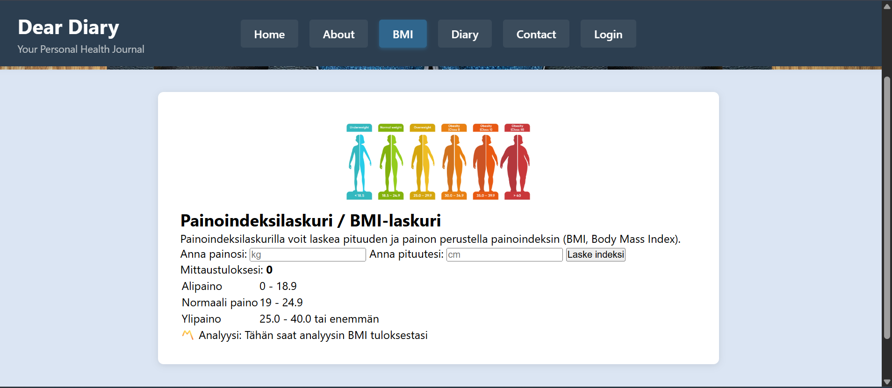

###### Dear Diary -Your Personal Health Journal #######

Tässä projektissa käytin teköälytyökaluja ohjelmointi apuna

Muunmuuassa käytin tekoälyä:

-Virheiden etsimisessä
-Virheenläsittellyssä
-Frontendissä HTML ja CSS luokkien  ja id luontiin ja niiden helppoon yhdistömiseen
-Jokaisen sovelluksen ulkoasun synkronoimiseen
-Koodin rakenteen tarkistamisessa

Kävin tekoälyn antamat ehdotukset läpi ja muokkasin niitä ennen kuin otin ne käyttöön projektissa.

Sovellus käyttää Restful-taustapalvelua joka tarjoaa API-rajapintaa

## Sovelluksen ominaisuudet

- käyttäjän rekisteröityminen
- käyttäjän kirjautuminen
- JWT-autentikaatio
- päiväkirjamerkintöjen listaus
- uuden merkinnän lisääminen
- merkinnän tarkastelu
- merkinnän poistaminen
- BMI-laskuri
- responsiivinen käyttöliittymä
- Flexbox-layout korttien näyttämiseen

## Teknologiat

Frontend on toteutttu käyttäen:

-HTML
-CSS
    -Flexbox
-Javascript
    -Fetch APi
    -JWT Authentication

## API

Frontend käyttää myös backend REST API:ta

Backend Repo:

https://github.com/ShottyShane252/hyte-web-dev-BE

Endpoints used

POST /api/users
POST /api/users/login
GET /api/users/me
GET /api/entries
GET /api/entries/:id
POST /api/entries
DELETE /api/entries/:id

### Kuvakaappaukset

## Koti

## login sivu

## diary sivu

## BMI laskuri

